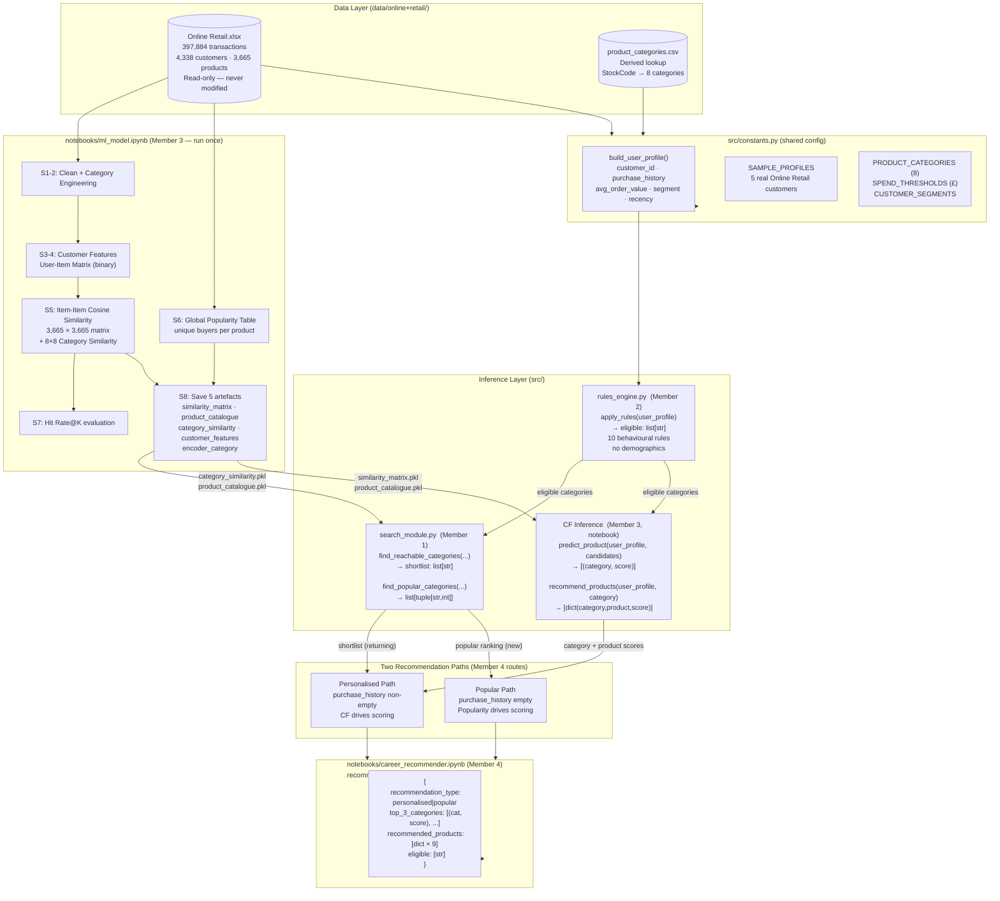

# System Architecture — CIC6314 Smart Product Recommendation System

> **Pivoted 2026-06-07:** suvroo (synthetic) → UCI Online Retail (real UK transactions)
> Approach: Item-Based Collaborative Filtering + Popularity Fallback



---

## Module Status

| Module | Owner | Status |
|---|---|---|
| `src/constants.py` | Member 3 | ✅ Updated — 8 categories, £ thresholds, new profile schema |
| `notebooks/ml_model.ipynb` | Member 3 | ✅ Rewritten — ❌ needs `Restart & Run All` to save artefacts |
| `data/online+retail/product_categories.csv` | Member 3 | ✅ Generated |
| `src/rules_engine.py` | Member 2 | ❌ Not yet implemented (brief: `agent_handoff/rules_handoff.md`) |
| `src/search_module.py` | Member 1 | ❌ Not yet implemented (brief: `agent_handoff/search_handoff.md`) |
| `notebooks/career_recommender.ipynb` | Member 4 | ❌ Not yet implemented (brief: `agent_handoff/integration_handoff.md`) |

---

## Data Flow Summary

```
Online Retail.xlsx  (read-only)
   └─► notebooks/ml_model.ipynb  (run once offline)
          ├─► similarity_matrix.pkl      (3,665 × 3,665 item cosine similarity)
          ├─► category_similarity.pkl    (8 × 8 category cosine similarity)
          ├─► product_catalogue.pkl      (descriptions + categories + popularity)
          ├─► customer_features.pkl      (per-customer derived features)
          └─► encoder_category.pkl

At inference time:
   build_user_profile()
          │
          ▼
   apply_rules()           → eligible categories  (Member 2)
          │
          ├─ purchase_history EMPTY ──────────────────────────
          │   find_popular_categories()              (Member 1)
          │   → popular categories + products
          │   recommendation_type = "popular"
          │
          └─ purchase_history NON-EMPTY ──────────────────────
              find_reachable_categories()            (Member 1)
              → shortlist (BFS on category graph)
              predict_product()                      (Member 3)
              → ranked categories by CF score
              recommend_products() × 3               (Member 3)
              → 3 products per top-3 category
              recommendation_type = "personalised"
                         │
                         ▼
                   recommend()                       (Member 4)
                   → {recommendation_type, top_3_categories,
                      recommended_products, eligible}
```

---

## Key Design Decisions

| Decision | Rationale |
|---|---|
| Item-based CF instead of ML classifier | Real co-purchase signal; no data leakage; no synthetic pairs; model is a 50 MB matrix vs 231 MB Random Forest |
| No demographics | Online Retail has no age/gender; CF doesn't need them |
| Two-path routing | CF cannot score users with zero purchase history; popularity is the honest cold-start fallback |
| 8 categories (not 6) | Better reflects Online Retail's natural product distribution |
| Products from top-3 categories | Avoids over-reliance on single top category; 9 products total per recommendation |
| `recommendation_type` flag | Signals to display layer whether scores are CF similarity or popularity counts |
